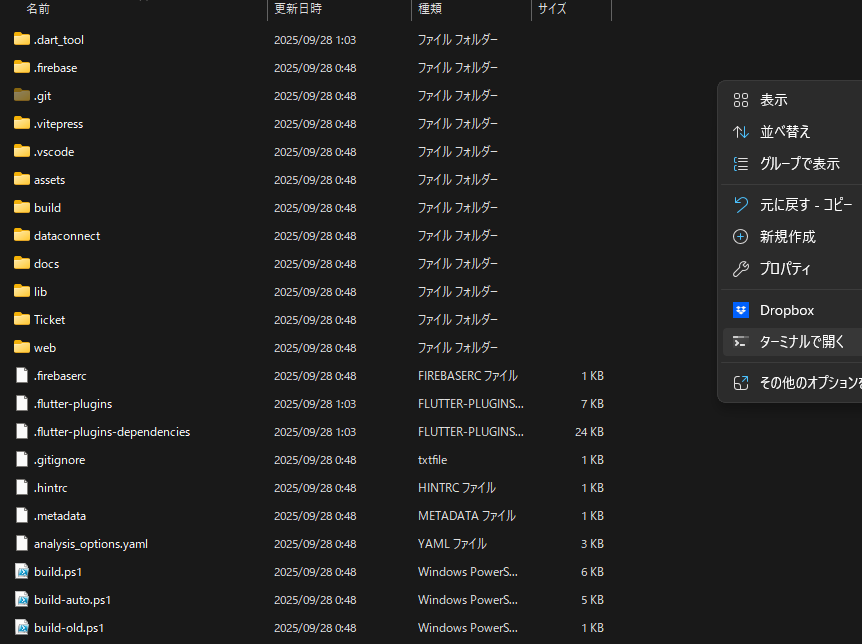

# 公開する
アプリの設定が完了したら、Webに公開します。
::: tip ヒント
1時間当たり10回かそれ未満の回数制限があるようなので、むやみやたらにやらないほうがいいです。
:::
1. 今まで編集してきたフォルダの一番上の階層(``shikon-voteapp.github.io``)で右クリックし、``ターミナルで開く``を選択します。

2. ターミナルウィンドウが表示されるので、以下のコードを入力し、Enterを押して実行します。
```bash
./build.ps1
```
3. 以下の出力がされるので、該当する数字を入力し、Enterを押して確定させます。あとは待つだけです。
```bash
=== Version Management Start ===
Current version: 1.6.1.19

Version update options:
1. Patch version (1.0.0 -> 1.0.1)
2. Minor version (1.0.0 -> 1.1.0)
3. Major version (1.0.0 -> 2.0.0)
4. Build number only (1.0.0.1 -> 1.0.0.2)
5. Skip version update

Select option (1-5):
```
## 各オプションの意味
### 1. Patch version
軽微な不具合修正などに用います。画像や文章の差し替えを行ったときはこれを用います。
### 2. Minor version
大型ではない新機能実装などに用います。本アプリで用いる機会は少ないです。
### 3. Major version
大型アップデートなどに用います。本アプリで用いる機会はないはずです。
### 4. Build numver only と 5. Skip version update
使うことはありません。
## サイト公開先
[ここ](https://shikon-voteapp.github.io)