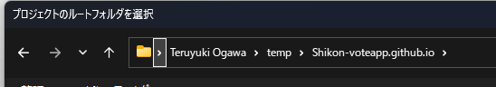
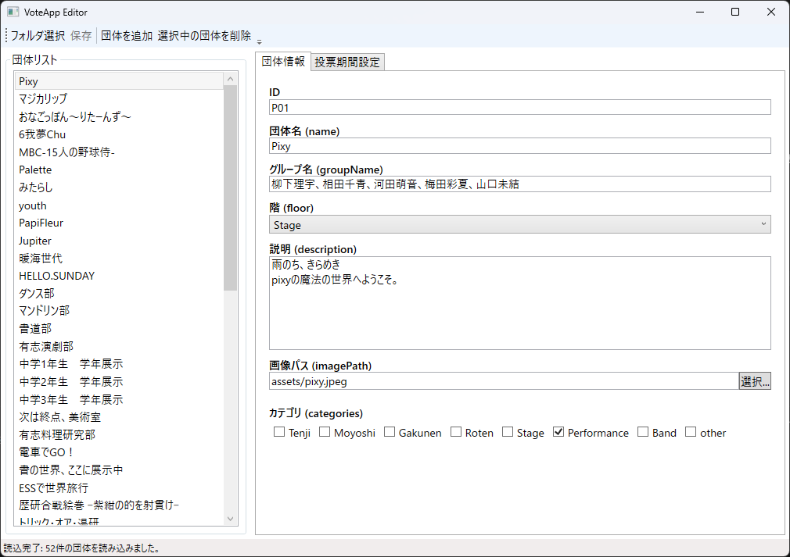
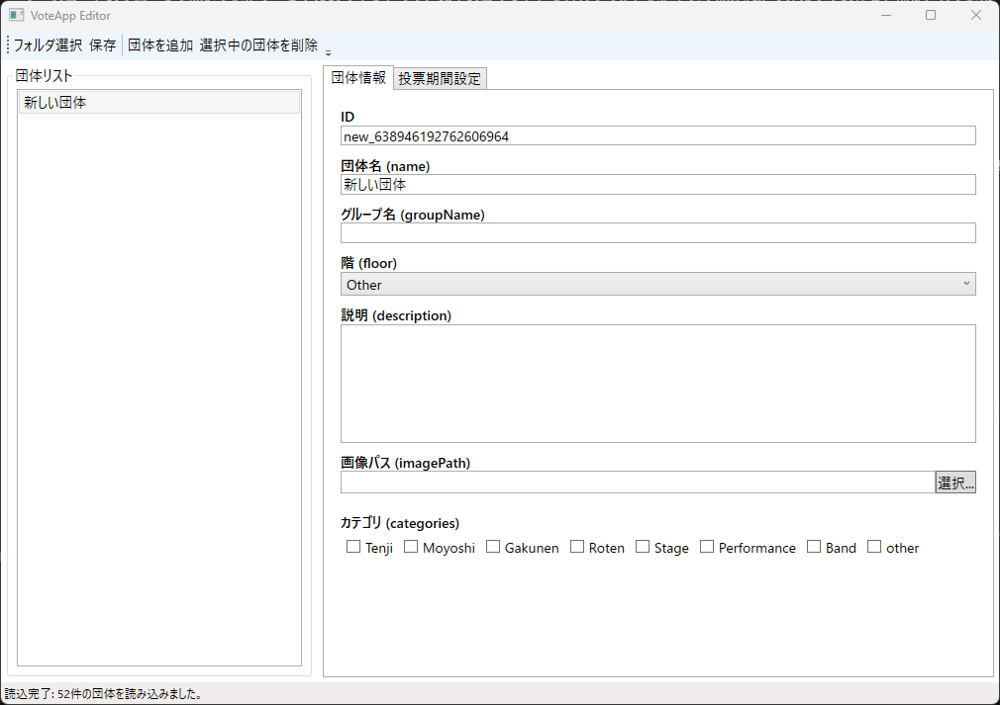
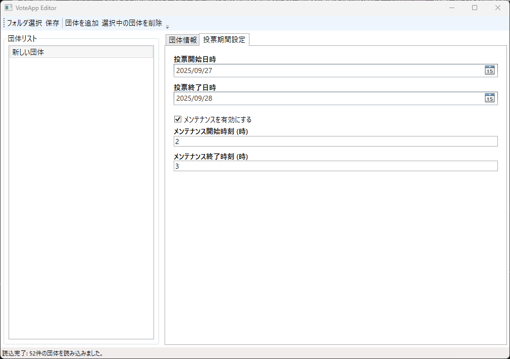

# 各年度向けのカスタマイズ
ソースコードのクローンで開いていたターミナルのウィンドウで、以下のコマンドを実行してください。そこで開かれたフォルダでの作業を前提としています。
```bash
[System.IO.Directory]::SetCurrentDirectory((Get-Location -PSProvider FileSystem).Path)
[System.IO.Directory]::GetCurrentDirectory() | clip
explorer.exe .
```
## 画像の配置
まず、投票先詳細の設定を行う前に、広報部門と連携し、投票先となる団体画像を貰ってください。
貰った画像は、``assets``フォルダ内に保存してください。読み込み時間の短縮のため、画像の解像度は出来る限り``2000x2000``未満、前年度の画像は都度削除してください。
また、``Fonts``フォルダは**絶対に**削除しないでください。
## 投票先の編集
1. ``shikon-voteapp.github.io``フォルダ(このページの一番上にあるコマンドで開くフォルダ)の中にある、``ShikonSettingApp.exe``をダブルクリックし、起動します。
2. フォルダを選択する画面が表示されるので、上部のアドレスバーをクリックし、``Ctrl+V``を押し、``Enter``を2回押して開きます。

3. 正常に起動すると、以下のような画面になります。

4. 各年度の最初の場合は、画面上部の``選択中の団体を削除``を連打し、空の状態から始めてください。
### 投票先の追加
1. 画面上部の``団体を追加``をクリックします。

2. テキストボックスを埋めるように、以下の情報を入力します。
- ID(英数字)　：　団体を区別する任意のIDです。内部的に使用されるのみのため、変更しなくても構いません。
- 団体名(name)　：　アプリ内で実際に表示される団体名称です。
- グループ名(groupName)　：　文化部やクラス等で、催し物の名称とそれを管轄する団体の名称が異なる場合のみ入力してください。
- 階(Floor)　：　リストの中から、その展示がある階を選択してください。ステージ団体は``Stage``です。
- 説明(description)　：　団体から提出された、その団体の説明を入力してください。
- カテゴリ(Categories)　：　この団体が属するカテゴリを選択してください。これを選択しない場合、一部の賞に表示されません。
## 投票期間の編集

投票開始と終了の日程とメンテナンス時間を指定してください。メンテナンスを無効にすることもできます。
## 保存
編集が終わったら、左上の「保存」を押して保存します。
## 賞の編集
賞を編集するためには、ソースコードをいじる必要があるため少々面倒です。分からないことがある場合は、気軽に連絡をしてください。(以下は中級～上級向けの説明です。)
1. VSCode等で、``lib/config/vote_options.dart``を開きます。(先にDartの拡張機能を入れると便利です。)
2. 下のほうに、``final List<VoteCategory> voteCategories = [``から始まる行があるので、探します。
3. それに含まれるリストが、賞のリストです。以下が、設定する際に必要となるパラメータです。
### 基本形式
```dart
  VoteCategory(
    id: 'ID',
    name: 'name',
    description: 'description',
    shortHelpText: 'help',
    groups:
        allGroups
            .where((group) => group.categories.contains(GroupCategory.category))
            .toList(),
    canSkip: true,
  ),
```
### 各変数の内容
#### ID
内部で管理するIDです。英数字で重複しなければ、何を設定しても構いません。
#### name
アプリ内で表示される賞の名称です。
#### description
カテゴリごとに表示される「○○賞について」というダイヤログに記載される賞の説明文です。
#### shortHelpText
descriptionとともに補助的に表示される短文です。
#### groups
先ほどGUIで設定したカテゴリについて、どのカテゴリを含めるかを指定します。複数つなげる場合は、以下のように記載します。
これを記載しない場合、``canSkip``が``false``だとアプリが進行不能になるため、確実に設定してください。
```dart
    groups:
        allGroups
            .where(
              (group) =>
                  group.categories.contains(GroupCategory.Tenji) ||
                  group.categories.contains(GroupCategory.Moyoshi) ||
                  group.categories.contains(GroupCategory.Gakunen) ||
                  group.categories.contains(GroupCategory.Roten) ||
                  group.categories.contains(GroupCategory.Stage),
            )
            .toList(),
```
#### canSkip
その賞がスキップ可能かどうかを指定します。明示的に指定しない場合、自動的に``false``となります。
## 投票番号の編集
投票番号も割り当て直すことができます。``/lib/config/``にExcelのサンプルがあるので、それを参考に設定してください。
生徒用は``convert_student.exe``、全体の有効IDは``convert_valid_uuid.exe``でそれぞれDartデータに変換することができます。
面倒なので非推奨。
## 投票券
``/Ticket/``に元データとなるExcelファイルと差し込み印刷用のWordファイルを入れてあるので、よかったら使ってください。