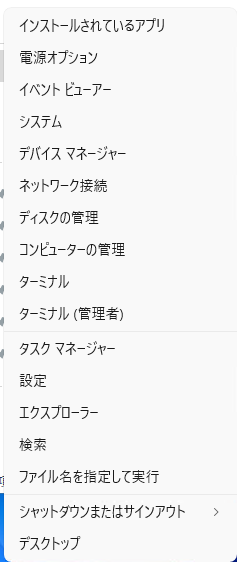
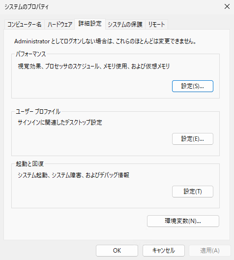
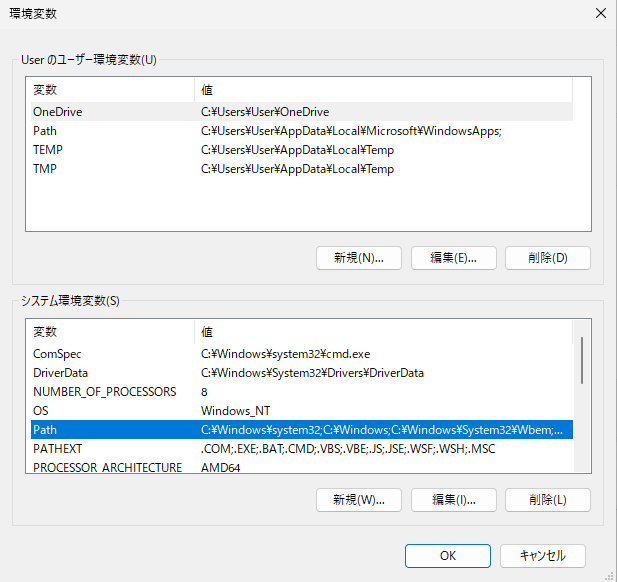
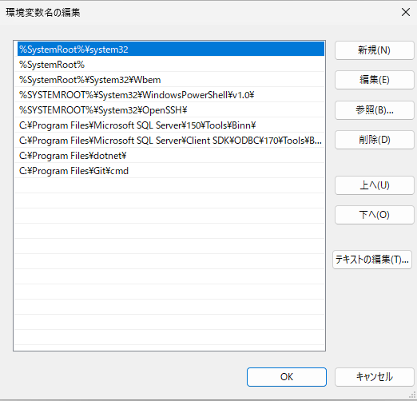
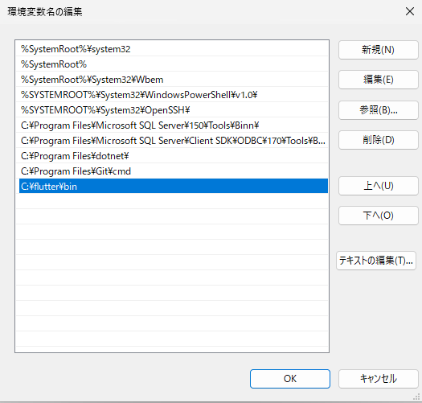
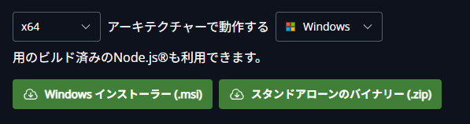
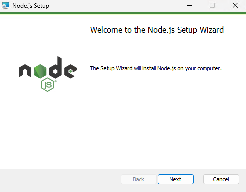

# 環境構築

## 必要なものを用意する
紫紺祭投票アプリの設定を行うには、以下の要件を満たしたデバイス等が必要です。
- 64ビットバージョンの Windows 10 または Windows 11 を搭載したパソコン
<!-- Container with Custom Title -->
::: tip ヒント
高校Ⅰ年次に購入する学習用ノートPCで正常に動作することを確認しています。
5GB 以上の空き容量が必要です。
:::
- Google 認証システムがインストールされたスマートフォン
- Google 認証システム用の QR コードが記された紙
<!-- Container with Custom Title -->
::: warning 注意
引継ぎ時に渡されていない場合は、担当教員の先生に相談するか、[このメールアドレス](mailto:mamouna.inori@outlook.jp)まで連絡をしてください。
:::
## 必要な知識
### Windows の基本・応用操作
このチュートリアルでは、Windows 11 を使用します。設定やエクスプローラーの開き方、エクスプローラー画面各部の名称をご存じない場合は、まず検索エンジンを使って最低限の操作方法を勉強されることをおすすめします。

## 本項で略して使う言葉
**「スタート右クリック」**：タスクバーにあるWindowsロゴ(青い田のロゴ)を右クリックしたメニューを開くこと。画像のようなメニューが表示されます。


## はじめに
文化祭準備委員会　総務部門ないしはそれに類する部門の部門長・副部門長を引き受けてくださり、ありがとうございます。 2025 年度文化祭準備委員会　総務部門長の小川です。
紫紺祭では 2025 年度より、教室展示等の各賞を決定する際に生徒・来校者双方へ行われる投票を円滑に運営するため、電子システムによる集計を開発・導入しました。このチュートリアルでは、本システムを各年度用に日程や投票先をカスタムする際に必要となる進め方・知識を解説しています。ぜひ、最後まで目を通していただき、円滑な投票運営へお役立てください。
また、本チュートリアルを読んだうえで質問等がある場合には、[このメールアドレス](mailto:mamouna.inori@outlook.jp)まで連絡をしてください。
<!-- Container with Custom Title -->
::: warning 注意
紫紺祭関連であることがわからない場合、迷惑メールとして読み捨てる場合がありますのでご注意ください。
:::

## 開発者モードの有効化
1. Windows の設定を開き、左側のメニューから``システム``を選択します。
2. その中から、``開発者向け``を選択します。
3. ``開発者モード``を有効にします。
4. 下にスクロールし、 ``PowerShell`` の項目をクリックして展開、``署名せずに実行するローカル PowerShell スクリプトを許可するように、実行ポリシーを変更します。リモートスクリプトには署名が必要です。``を有効にします。


## Git のインストール・設定
### Git のインストール
1. [Git のダウンロードページ](https://git-scm.com/downloads)にアクセスし、右側にある`` Download for Windows ``をクリックします。
2. 次のページに飛ぶので、本文の一番上にある`` Click here to download ``をクリックします。
3. ``Git-(バージョン名)-64-bit.exe`` がダウンロードされるので、それをダブルクリックして起動します。
4. このような画面が表示されたら、画面右下の ``Next`` を連打して、インストールを完了させてください。特に途中で設定を変更する必要はありません。


### Git の初期設定
1. タスクバーのWindowsロゴ(4つの窓が並んだアイコン)を右クリックし、``ターミナル(管理者)``をクリックします。
2. ターミナルのウィンドウが表示されるので、以下の2行を入力・コピペし、<kbd>Enter</kbd>を押して実行します。
``` bash
git config --global user.email Meiji.hs.vote@gmail.com
git config --global user.name ShikonFes_Sohmu
```
以上で、Git の初期設定は完了です。(Gitからの出力はありません。)
## Flutter SDKのインストール
1. [Flutter SDKのダウンロードページ](https://docs.flutter.dev/get-started/install/windows/web)にアクセスし、 **Install the Flutter SDK** の見出しの項にある「 Download and install 」を押します。

2. その下にある青いボタン「flutter_windows_(バージョン名)-stable.zip」を押し、 Zip ファイルをダウンロードします。
3. ダウンロードした Zip ファイルを開き、中にある「``flutter``」フォルダを``C:\``以下にコピーします。
::: tip ヒント
エクスプローラー上部の「ダウンロード > flutter_windows_3.35.4-stable」が書かれているところに、``C:\``と入力すると、``C:\``に飛ぶことができるので、そこに展開した``Flutter``フォルダを貼り付けるとよいです。
:::
## 環境変数の設定
先ほどダウンロードし、``C:\Flutter``以下、または任意の場所へ展開したフォルダ内の``bin``フォルダを環境変数へ登録します。
1. フォルダ構造の確認
先ほどコピーした``flutter``フォルダから``bin``というフォルダを探し、右クリックメニューから``パスをコピー``を選択します。

2. スタート右クリックから、``システム``を選択し、表示された設定ウィンドウから``システムの詳細設定``を探します。
3. このようなウィンドウが表示されたら、右下の``環境変数(N)...``をクリックします。

4. このようなウィンドウが表示されるので、下の``システム環境変数``のリストの中から、``Path``という項目を探し、クリックして青く選択された状態にしたら、右下の``編集(I)...``をクリックします。

5. このようなウィンドウが表示されたら、右側の``新規(N)``をクリックし、先ほどコピーしたパスを貼り付けます。

::: warning 注意
貼り付けた際に一緒についてくる``""``(ダブルクォーテーション)は必ず削除してください。
:::
以下のような状態になればOKです。ここではやっていませんが、右側の``上へ(U)``を連打して、今追加したものが一番上になるように設定しておくと安定しやすいです。作業が完了したら、パソコンを再起動してください。

## 確認
1. スタート右クリックから、``ターミナル(管理者)``をクリックします。
2. ターミナルウィンドウが表示されるので、``flutter``と入力します。
3. 成功していたら、以下のような出力がされます。(あくまで例です。)``flutter : 用語 'flutter' は、コマンドレット、関数、スクリプト ファイル、または操作可能なプログラムの名前として認識されません。``と表示される場合、どこかで間違っているのでよく見直してもう一度設定してみてください。
```bash
Manage your Flutter app development.

Common commands:

  flutter create <output directory>
    Create a new Flutter project in the specified directory.

  flutter run [options]
    Run your Flutter application on an attached device or in an emulator.

Usage: flutter <command> [arguments]

Global options:
-h, --help                  Print this usage information.
-v, --verbose               Noisy logging, including all shell commands executed.
                            If used with "--help", shows hidden options. If used with "flutter doctor", shows additional
                            diagnostic information. (Use "-vv" to force verbose logging in those cases.)
-d, --device-id             Target device id or name (prefixes allowed).
    --version               Reports the version of this tool.
    --enable-analytics      Enable telemetry reporting each time a flutter or dart command runs.
    --disable-analytics     Disable telemetry reporting each time a flutter or dart command runs, until it is
                            re-enabled.
    --suppress-analytics    Suppress analytics reporting for the current CLI invocation.

Available commands:

Flutter SDK
  bash-completion   Output command line shell completion setup scripts.
  channel           List or switch Flutter channels.
  config            Configure Flutter settings.
  doctor            Show information about the installed tooling.
  downgrade         Downgrade Flutter to the last active version for the current channel.
  precache          Populate the Flutter tool's cache of binary artifacts.
  upgrade           Upgrade your copy of Flutter.

Project
  analyze           Analyze the project's Dart code.
  assemble          Assemble and build Flutter resources.
  build             Build an executable app or install bundle.
  clean             Delete the build/ and .dart_tool/ directories.
  create            Create a new Flutter project.
  drive             Builds and installs the app, and runs a Dart program that connects to the app, often to run
                    externally facing integration tests, such as with package:test and package:flutter_driver.
  gen-l10n          Generate localizations for the current project.
  pub               Commands for managing Flutter packages.
  run               Run your Flutter app on an attached device.
  test              Run Flutter unit tests for the current project.

Tools & Devices
  attach            Attach to a running app.
  custom-devices    List, reset, add and delete custom devices.
  devices           List all connected devices.
  emulators         List, launch and create emulators.
  install           Install a Flutter app on an attached device.
  logs              Show log output for running Flutter apps.
  screenshot        Take a screenshot from a connected device.
  symbolize         Symbolize a stack trace from an AOT-compiled Flutter app.

Run "flutter help <command>" for more information about a command.
Run "flutter help -v" for verbose help output, including less commonly used options.
```
## node.jsのインストール
1. [node.js のダウンロードページ](https://nodejs.org/ja/download)にアクセスし、下のほうの``x64 アーキテクチャーで動作する Windows 用のビルド済みの Node.js® も利用できます。``と書いてあるところまでスクロールします。
2. 左側の``Windows インストーラー(.msi)``をクリックし、インストーラーをダウンロードします。

3. ``node-(バージョン名)-x64.msi``がダウンロードされるので、それをダブルクリックして起動します。
4. このような画面が表示されたら、画面右下の``Next``を連打して、インストールを完了させてください。最初の``Licence Agreement``以外、特に設定を変更する必要はありません。
